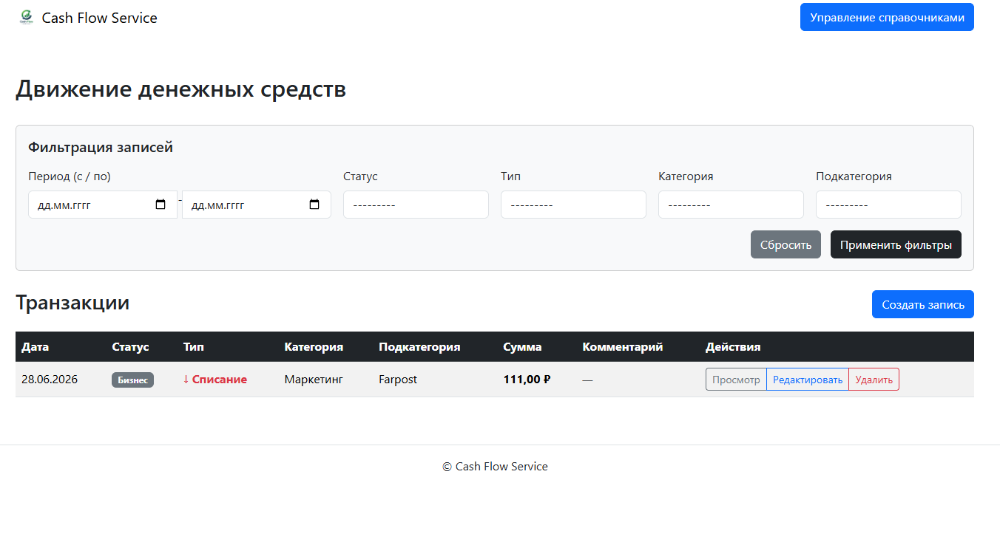
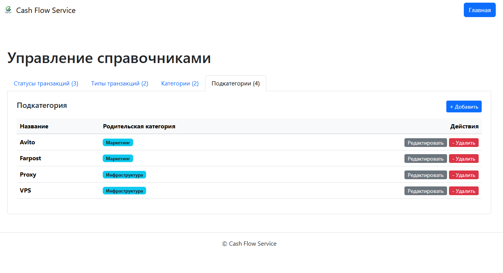
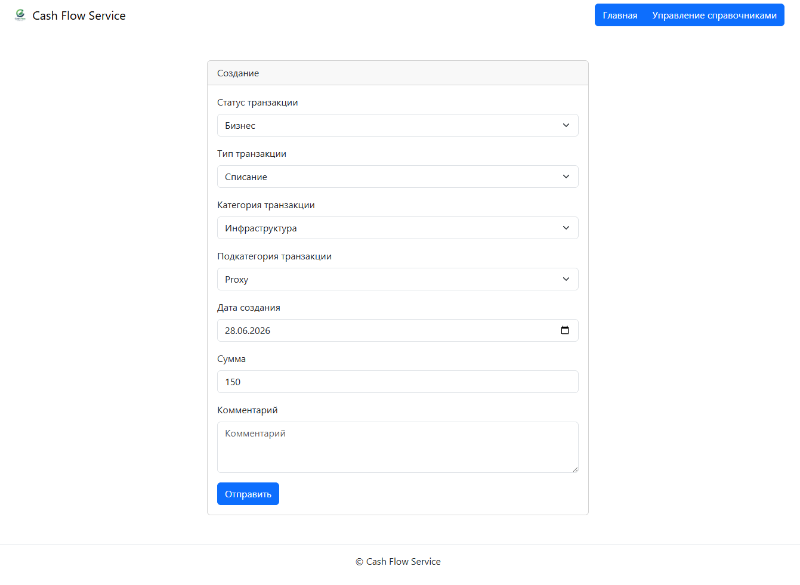

# cash_flow_service
 Веб-сервис для управления движением денежных средств

ДДС (движение денежных средств) — это процесс учета, управления и анализа
поступлений и списаний денежных средств компании или частного лица.

## Запуск проекта:

1. Клонируйте репозиторий:

```bash
git clone https://github.com/DanilZheltikov/cash_flow_service.git
```
2. Перейдите в директорию проекта:

```bash
cd cash_flow_service

```
---

### Запуск в режиме разработки (без Docker):

1. Создайте и активируйте виртуальное окружение:

```bash
# Windows:
python -m venv venv
source venv/Scripts/activate

# Linux / Mac:
python3 -m venv venv
source venv/bin/activate
```

2. Установите зависимости:

```bash
pip install -r requirements.txt
```

3. Выполните миграции:

```bash
python manage.py migrate
```

4. Загрузите моковые данные:

```bash
python manage.py load_mock_data
```

5. Запустите сервер разработки:

```bash
python manage.py runserver
```

6. Проект будет доступен по **[ссылке](http://127.0.0.1:8000/)**

---

### Запуск через Docker Compose (Рекомендуется):

1. Создайте файл `.env` в корне проекта и заполните следующие переменные:

```env
SECRET_KEY=ваш-секретный-ключ
DEBUG=либо ставим 'true' либо 'false'
ALLOWED_HOSTS=перечисляем,хосты,через,запятую
```

2. Запустите **Docker Compose**:

```bash
docker compose up -d
```

2. Подготовьте проект:

```bash
docker compose exec web /app/init.sh
```

3. Проект будет доступен локально по **[ссылке](http://localhost/)**

---

## Ссылка на проект:

- С проектом можно ознакомиться по **[ссылке](http://8488367-kh371444.twc1.net/)**

---

## Скриншоты:

### Главная:


### Страница справочников:


### Страница с формами:




## :man_technologist: Автор

* [Danil Zheltikov](https://github.com/DanilZheltikov)